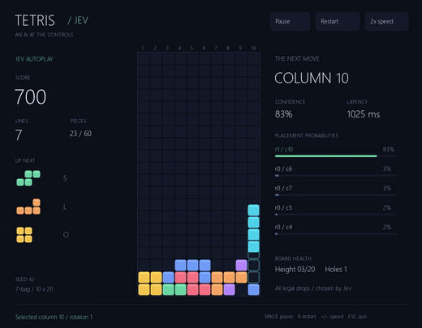
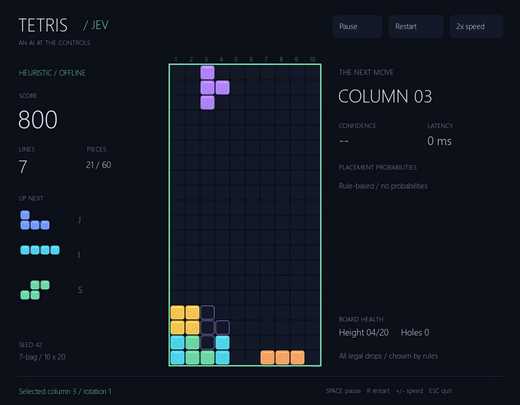

# Tetris / Jev

[English](README.md)

**같은 테트리스, 서로 다른 판단 방식.** TypeSafe Jev가 블록을 놓는 위치를
선택하는 모습을, API 없이 동작하는 규칙 기반 플레이와 비교합니다.

## 플레이 영상

| Jev API 모드 | 오프라인 규칙 모드 |
| --- | --- |
| [](media/jev.mp4) | [](media/offline.mp4) |
| [전체 영상 1분 15초](media/jev.mp4) · [스크린샷](media/jev.png) | [전체 영상 29초](media/offline.mp4) · [스크린샷](media/offline.png) |

두 모드 모두 **시드 42, 최대 60개 블록, 애니메이션 2배속**으로 플레이했습니다.

| 결과 | Jev | 오프라인 |
| --- | ---: | ---: |
| 배치한 블록 | 60개 | 60개 |
| 제거한 줄 | 22줄 | 22줄 |
| 점수 | 3,800점 | 3,700점 |
| 최종 높이 / 빈 구멍 | 3칸 / 1개 | 3칸 / 1개 |
| API 호출 | 60회 | 없음 |

둘 다 게임오버 없이 블록 수 제한에 도달했습니다. 줄 제거 시점과 묶음에 따라
레벨별 점수가 달라집니다. **한 시드의 데모 결과이므로 Jev의 일반적인 우위를
증명하는 벤치마크는 아닙니다.** 다시 실행하면 모델 선택과 응답 시간이 달라질 수 있습니다.

## 어떻게 다른가요?

- **Jev**: 현재 보드와 가능한 배치별 높이·구멍·굴곡·제거할 줄 수를 전달합니다.
  모델이 회전과 열을 선택하면 코드가 낙하 애니메이션과 실제 배치를 수행합니다.
  가능한 배치를 규칙으로 미리 순위 매기거나 추려서 전달하지 않습니다.
- **오프라인**: 줄 제거에 가점, 높이·구멍·굴곡에 감점을 주는 고정 계산식으로 선택합니다.
  API 키와 비용이 필요 없으며 모델 확률을 만들어 표시하지 않습니다.
- 추론을 기다리는 동안 게임은 멈춥니다. 네트워크 지연 때문에 블록을 놓치지 않습니다.
- 반복 플레이가 모델 자체를 학습시키지는 않습니다.

표준 규칙 전체를 구현한 테트리스는 아닙니다. 10×20 보드, 7-bag 블록 생성,
수직 낙하 배치를 사용하며 홀드·벽차기·끼워넣기·T-spin·실시간 중력은 없습니다.

## 실행

Python 3.13 이상과 uv를 준비합니다.

```powershell
git clone https://github.com/chahero/tetris-jev.git
cd tetris-jev
uv venv --python 3.13 .venv
uv pip install --python .venv\Scripts\python.exe -e ".[dev]"
Copy-Item .env.example .env # 첫 설정에만 실행하세요.
```

`.env`에 `TYPESAFE_API_KEY=실제키`를 입력한 뒤 실행합니다.

- `play.cmd`: Jev API 자동 플레이
- `play-offline.cmd`: API 없는 자동 플레이
- Space: 일시정지·재개, R: 같은 시드로 재시작, +/-: 속도 순환, Esc: 종료
- 기본 한도는 한 판 200개 블록입니다. `--max-pieces 60`으로 변경할 수 있습니다.
- `--paused`를 붙이면 API를 호출하지 않고 일시정지 상태로 창을 엽니다.
